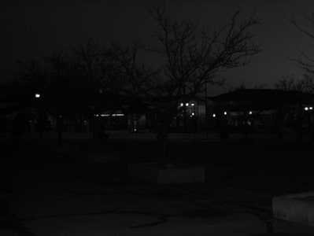

# ComputerVision-Image-Representations-and-Point-Operations

  

python version: 3.9

platform: visual studio code

#### files and functions description 

ex1_main.py-

	def histEqDemo(img_path: str, rep: int):
		Image histEq display

	def quantDemo(img_path: str, rep: int):
		Image Quantization display

ex1_utils.py-

	def imReadAndConvert(filename: str, representation: int) -> np.ndarray:
		Reads an image, and returns in converted as requested

	def imDisplay(filename: str, representation: int):
		Reads an image as RGB or GRAY_SCALE and displays it

	def transformRGB2YIQ(imgRGB: np.ndarray) -> np.ndarray:
		Converts an RGB image to YIQ color space
	def transformYIQ2RGB(imgYIQ: np.ndarray) -> np.ndarray:
    		Converts an YIQ image to RGB color space

	def hsitogramEqualize(imgOrig: np.ndarray) -> (np.ndarray, np.ndarray, np.ndarray):
   		Equalizes the histogram of an image

	def fix_q(z: np.array, image_hist: np.ndarray) -> np.ndarray:
        	Calculate the new q using wighted average on the histogram
    def fix_z(q: np.array, z: np.array) -> np.array:
            Calculate the new z using the formula from the lecture.
	def findBestCenters(histOrig: np.ndarray, nQuant: int, nIter: int) -> (np.ndarray, np.ndarray):
        	Finding the best nQuant centers for quantize the image in nIter steps or when the error is minimum
	def convertToImg(imOrig: np.ndarray, histOrig: np.ndarray, yiqIm: np.ndarray, arrayQuantize: np.ndarray) ->(np.ndarray, float):
        	Executing the quantization to the original image
	def quantizeImage(imOrig: np.ndarray, nQuant: int, nIter: int) -> (List[np.ndarray], List[float]):
        	Quantized an image in to nQuant colors

gamma.py-

	def gammaDisplay(img_path: str, rep: int):
    		GUI for gamma correction
	def adjust_gamma(image: np.ndarray, gamma: float) -> np.ndarray:
        	Gamma correction

testImg1.jpg - dark image.

	i chose this image because the original image was very dark and i would expect the histogram equalization function to turn it into more brighter and clear image
	
testImg2.jpg - standard image with many colors.

	
	i chose this image to examine whether the quantizeImage() works on a images with many colors.
	

